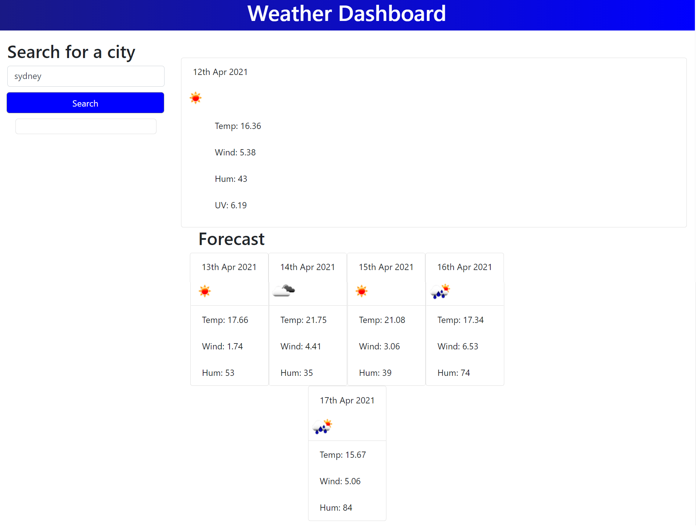

# Weather Dashboard
## Overview
This Project was to develop a weather dashboard utilising **https://Openweathermap.org** onecall API. The goal was to show a current day and forecast based on city selection

## Description of Operation
* GIVEN a weather dashboard with form inputs
* WHEN you search for a city
* THEN you am presented with current and future conditions for that city 
* WHEN you view current weather conditions for that city
* THEN you are presented with the city name, the date, an icon representation of weather       conditions, the temperature, the humidity, the wind speed, and the UV index
* WHEN you view future weather conditions for that city
* THEN you are presented with a 5-day forecast that displays the date, an icon representation of weather conditions, the temperature, the wind speed, and the humidity

## Link to deployed Application

<font size ="6">**https://tbr2000.github.io/weather-dashboard/**</font>

## Example Screenshot of Application



```